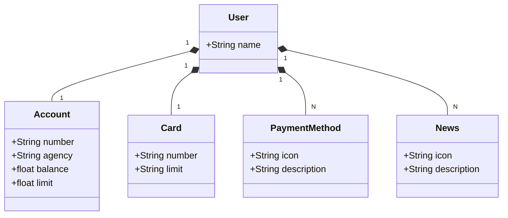

# Bank pratice project

### Diagrama

```mermaid
classDiagram
    class User {
        +String name
    }

    class Account {
        +String number
        +String agency
        +float balance
        +float limit
    }

    class PaymentMethod {
        +String icon
        +String description
    }

    class Card {
        +String number
        +String limit
    }

    class News {
        +String icon
        +String description
    }

    User "1" *-- "1" Account
    User "1" *-- "1" Card
    User "1" *-- "N" PaymentMethod
    User "1" *-- "N" News
```
